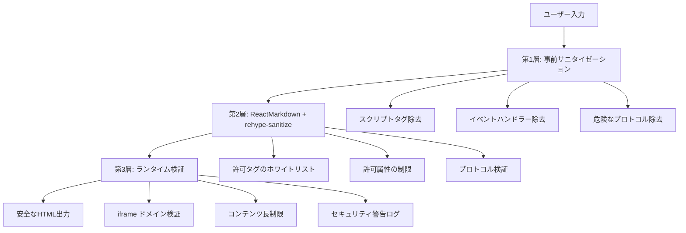

# セキュリティガイドライン

このドキュメントでは、Himawari ブログで HTML コンテンツを安全に使用するためのセキュリティガイドラインについて説明します。

## 概要

Himawari ブログでは、多層防御アプローチを採用して XSS 攻撃やその他のセキュリティ脆弱性を防止しながら、リッチな HTML コンテンツの作成を可能にしています。

## セキュリティアーキテクチャ

### 3 層のセキュリティ防御



## 許可されている HTML タグ

### 安全なタグ一覧

#### テキスト装飾

- `p`, `br`, `strong`, `em`, `u`, `del`, `s`, `ins`, `mark`, `small`, `sub`, `sup`

#### 見出し

- `h1`, `h2`, `h3`, `h4`, `h5`, `h6`

#### リスト

- `ul`, `ol`, `li`, `dl`, `dt`, `dd`

#### コードと引用

- `blockquote`, `code`, `pre`, `kbd`, `samp`, `var`

#### メディア

- `img`, `video`, `audio`, `source`, `track`
- `iframe` (ドメイン制限あり)

#### テーブル

- `table`, `thead`, `tbody`, `tfoot`, `tr`, `th`, `td`, `caption`, `colgroup`, `col`

#### レイアウトコンテナ

- `div`, `span`, `section`, `article`, `aside`, `header`, `footer`, `main`, `nav`

#### インタラクティブ要素（制限付き）

- `button`, `details`, `summary`

#### フォーム（基本要素のみ）

- `form`, `input`, `textarea`, `select`, `option`, `optgroup`, `label`, `fieldset`, `legend`

## 禁止されているタグと属性

### 完全に禁止されているタグ

```html
<!-- これらのタグは自動的に除去されます -->
<script>
  alert("XSS");
</script>
<object data="malicious.swf"></object>
<embed src="malicious.swf" />
<applet code="Malicious.class"></applet>
<meta http-equiv="refresh" content="0;url=http://evil.com" />
<link rel="stylesheet" href="http://evil.com/malicious.css" />
<style>
  body {
    display: none;
  }
</style>
<base href="http://evil.com/" />
```

### 禁止されている属性

```html
<!-- これらの属性は自動的に除去されます -->

<div onclick="maliciousFunction()">クリック</div>
<a href="javascript:alert('XSS')">リンク</a>
<iframe src="data:text/html,<script>alert('XSS')</script>"></iframe>
```

### 危険な CSS パターン

```html
<!-- これらのスタイルは自動的にサニタイズされます -->
<div style="background: url(javascript:alert(1))">危険</div>
<div style="expression(alert(1))">危険</div>
<div style="behavior: url(malicious.htc)">危険</div>
<div style="-moz-binding: url(malicious.xml)">危険</div>
```

## 許可されている iframe ドメイン

### 動画プラットフォーム

- `youtube.com`, `www.youtube.com`, `youtu.be`
- `vimeo.com`, `player.vimeo.com`

### 開発プラットフォーム

- `codepen.io`
- `codesandbox.io`
- `jsfiddle.net`
- `github.com`, `gist.github.com`

### iframe 使用例

```html
<!-- 許可される例 -->
<iframe src="https://www.youtube.com/embed/VIDEO_ID"></iframe>
<iframe src="https://codepen.io/user/embed/pen-id"></iframe>

<!-- 拒否される例 -->
<iframe src="https://malicious-site.com/evil"></iframe>
<iframe src="data:text/html,<script>alert('XSS')</script>"></iframe>
```

## セキュリティベストプラクティス

### 1. 信頼できるソースからのコンテンツ使用

```html
<!-- 良い例: 信頼できるドメインからの画像 -->


<!-- 注意が必要: 外部ドメインからの画像 -->

```

### 2. 適切な属性の使用

```html
<!-- 良い例: 安全な属性のみ使用 -->
<a href="https://example.com" target="_blank" rel="noopener noreferrer">
  外部リンク
</a>

<!-- 悪い例: 危険な属性（自動的に除去される） -->
<a href="javascript:alert('XSS')" onclick="maliciousFunction()">
  危険なリンク
</a>
```

### 3. フォーム要素の安全な使用

```html
<!-- 良い例: 基本的なフォーム要素 -->
<form action="/safe-endpoint" method="post">
  <label for="email">メールアドレス:</label>
  <input type="email" id="email" name="email" required />
  <button type="submit">送信</button>
</form>

<!-- 注意: JavaScriptイベントは除去される -->
<input type="text" onchange="maliciousFunction()" />
```

## セキュリティ警告とログ

### 警告の種類

システムは以下の場合にセキュリティ警告を出力します：

1. **スクリプトタグの検出**

   ```
   [Security Warning] Script tags detected and will be removed
   ```

2. **イベントハンドラーの検出**

   ```
   [Security Warning] Event handlers detected and will be removed
   ```

3. **信頼できない iframe ソース**

   ```
   [Security Warning] Iframe source from untrusted domain: https://evil.com
   ```

4. **危険なプロトコル**
   ```
   [Security Warning] Dangerous protocol detected: javascript:
   ```

### 開発環境での警告表示

開発環境では、セキュリティ問題が検出された場合に詳細な警告が表示されます：

```html
⚠️ Markdown Rendering Issues Detected [Fallback Mode: safe] View Details (2
issues) ├─ SECURITY_VIOLATION │ Script tags detected and will be removed │
2024-01-01 12:00:00 │ └─ DANGEROUS_ATTRIBUTE Event handler 'onclick' removed
from element 2024-01-01 12:00:01
```

## コンテンツ作成時の注意点

### 1. 外部コンテンツの埋め込み

```html
<!-- 推奨: 信頼できるプラットフォームのみ使用 -->
<iframe src="https://www.youtube.com/embed/VIDEO_ID"></iframe>

<!-- 非推奨: 未知のドメインからの埋め込み -->
<iframe src="https://unknown-video-site.com/embed/123"></iframe>
```

### 2. 画像の安全な使用

```html
<!-- 良い例: 適切なalt属性とサイズ指定 -->


<!-- 注意: onerror属性は自動的に除去される -->

```

### 3. リンクの安全な使用

```html
<!-- 推奨: 外部リンクには適切なrel属性を設定 -->
<a href="https://external-site.com" target="_blank" rel="noopener noreferrer">
  外部サイト
</a>

<!-- 危険: javascriptプロトコルは自動的に除去される -->
<a href="javascript:alert('XSS')">危険なリンク</a>
```

## セキュリティ設定のカスタマイズ

### 厳格モードの使用

高セキュリティが必要な場合は、厳格モードを使用できます：

```typescript
import { strictSanitizeConfig } from "../utils/sanitizeConfig";

// 厳格モードでは基本的なタグのみ許可
const allowedTags = [
  "p",
  "br",
  "strong",
  "em",
  "u",
  "del",
  "h1",
  "h2",
  "h3",
  "h4",
  "h5",
  "h6",
  "ul",
  "ol",
  "li",
  "blockquote",
  "code",
  "pre",
  "a",
  "img",
];
```

### カスタムドメインの追加

信頼できる iframe ドメインを追加する場合：

```typescript
// src/utils/sanitizeConfig.ts で設定
export const allowedIframeDomains = [
  // 既存のドメイン...
  "trusted-new-domain.com", // 新しい信頼できるドメイン
];
```

## インシデント対応

### セキュリティ問題の報告

セキュリティ問題を発見した場合：

1. **即座に使用を停止**
2. **問題の詳細を記録**
3. **開発チームに報告**
4. **影響範囲の調査**

### 緊急時の対応

```typescript
// 緊急時: すべてのHTMLを無効化
const emergencyConfig = {
  allowedTags: [],
  allowedAttributes: {},
  disallowedTagsMode: "discard",
};
```

## 定期的なセキュリティチェック

### 1. 設定の見直し

- 月次で許可タグ・属性の見直し
- 新しい脅威に対する対策の確認
- 信頼できるドメインリストの更新

### 2. ログの監視

```bash
# セキュリティ警告の確認
grep "Security Warning" logs/application.log

# 異常なパターンの検出
grep -E "(script|javascript:|on[a-z]+)" logs/content.log
```

### 3. テストの実行

```bash
# セキュリティテストの実行
npm run test:security

# XSS防止テストの実行
npm run test:xss
```

## まとめ

Himawari ブログのセキュリティシステムは：

1. **多層防御**により包括的な保護を提供
2. **ホワイトリスト方式**で安全なタグのみ許可
3. **自動サニタイゼーション**で危険なコンテンツを除去
4. **リアルタイム監視**でセキュリティ問題を検出

これらのガイドラインに従うことで、安全で豊かなコンテンツを作成できます。

## 関連ドキュメント

- [HTML タグ使用ガイド](HTML_USAGE_GUIDE.md) - HTML タグの使用方法
- [トラブルシューティングガイド](TROUBLESHOOTING_GUIDE.md) - 問題解決方法
- [セキュリティ機能詳細](../src/utils/SECURITY_FEATURES.md) - 技術的な実装詳細
